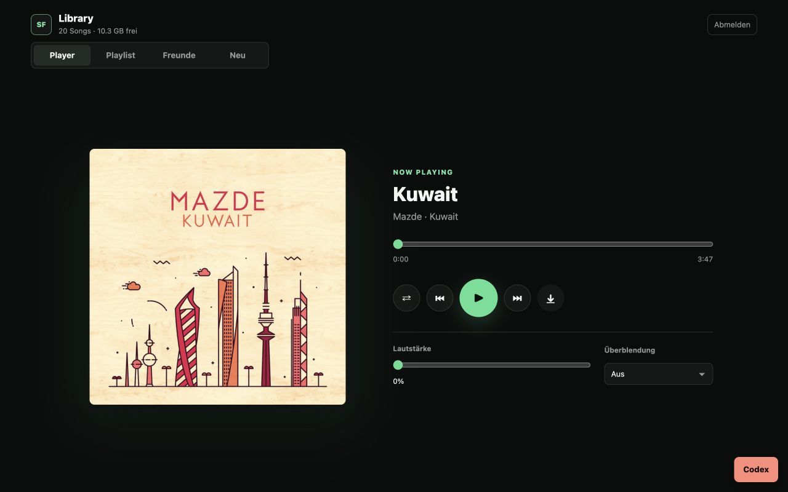
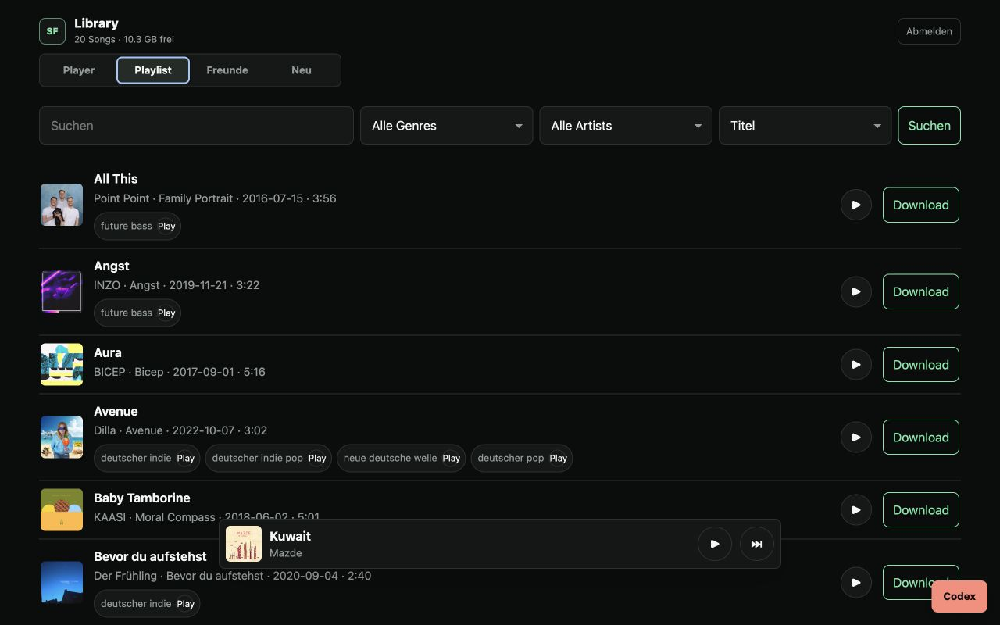
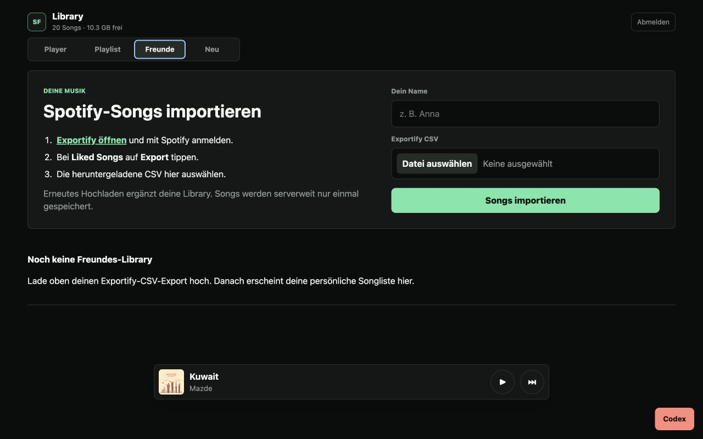
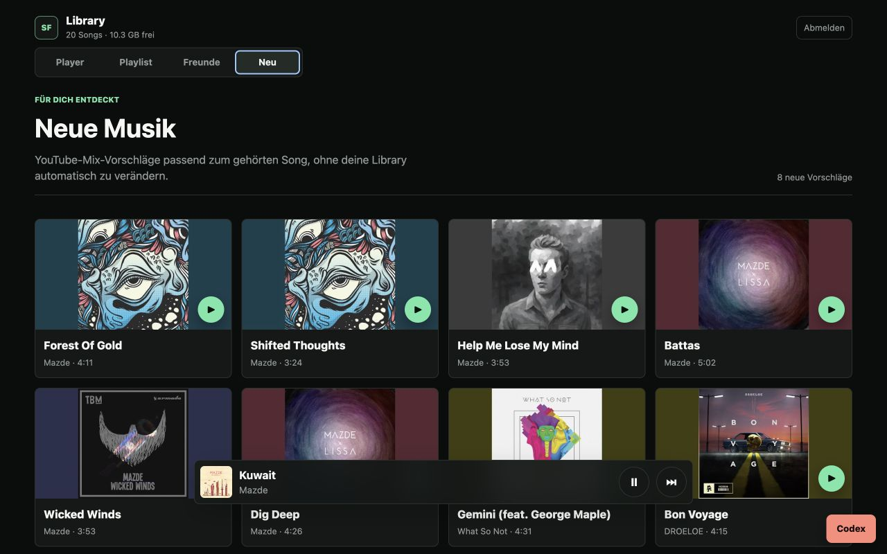

# Spotifree Player

[](https://www.python.org/)
[](LICENSE)
[](#quick-start)

**Turn a Spotify export into a private, mobile-first streaming library your friends can join from any browser, without storing duplicate tracks.**

Spotifree Player is a lightweight self-hosted music server built around
[spotDL](https://github.com/spotDL/spotify-downloader). It downloads the music
you request, serves it through a polished responsive player, gives every friend
a personal library, and discovers related music through YouTube Mixes.

## See it in action

| Player | Library |
| --- | --- |
|  |  |
| **Friend imports** | **Discover** |
|  |  |

## Why Spotifree?

- **One link for everyone.** Friends only need the website password and a
  browser. There is no client app to install.
- **Personal libraries, shared storage.** Exportify CSV files are merged per
  person while Spotify track IDs and downloaded audio are deduplicated globally.
- **A real mobile player.** Artwork, seeking, queue controls, volume, shuffle,
  crossfade, swipe navigation, downloads, and continuous background playback.
- **Useful discovery.** After listening for about 35 seconds, the `Neu` tab
  surfaces music from the original creators first, then related YouTube Mix
  tracks that are not already in the library.
- **Small and inspectable.** The web application uses Python's standard library
  and plain browser JavaScript. Runtime state stays outside Git.

## How it works

```text
Spotify / Exportify CSV
          |
          v
  deduplicated track queue -----> spotDL + yt-dlp -----> shared audio folder
          |                                                  |
          v                                                  v
  personal library metadata -----------------------> Spotifree web player
                                                             |
                                                             v
                                               YouTube Mix recommendations
```

Spotifree never adds recommendations to a person's library automatically.
Selecting a YouTube recommendation pauses local playback first. If a rights
holder blocks embedding, the original YouTube page remains available as a
fallback.

## Quick start

### Requirements

- Linux server with Python 3.11+
- `ffmpeg`
- `spotdl` and `yt-dlp` in a Python virtual environment
- systemd for the included services
- Caddy or another HTTPS reverse proxy

### 1. Install

```bash
sudo git clone https://github.com/eliaspfeffer/spotifree-player.git \
  /opt/spotify-song-server
cd /opt/spotify-song-server

sudo python3 -m venv venv
sudo venv/bin/pip install --upgrade pip spotdl yt-dlp

sudo mkdir -p music data friends inputs logs cookies cache state
```

### 2. Configure

Create `/etc/spotify-song-server.env`:

```bash
HOST=127.0.0.1
PORT=8088
BASE_DIR=/opt/spotify-song-server
MUSIC_ROOT=/opt/spotify-song-server/music
BASIC_AUTH_USER=music
BASIC_AUTH_PASSWORD=replace-this-with-a-long-random-password
```

Optional Spotify OAuth support:

```bash
SPOTIFY_CLIENT_ID=
SPOTIFY_CLIENT_SECRET=
SPOTIFY_REDIRECT_URI=https://music.example.com/spotify/callback
```

The Exportify CSV workflow does not require Spotify developer credentials.

### 3. Start the services

```bash
sudo cp systemd/* /etc/systemd/system/
sudo systemctl daemon-reload
sudo systemctl enable --now spotify-song-server.service
sudo systemctl enable --now spotify-song-download-ensure.timer
```

Edit `caddy/Caddyfile` with your domain and upstream, then install or import it
into your Caddy configuration. The application should only be exposed through
HTTPS when used outside a private network.

## Importing music

Friends can manage everything from the website:

1. Open the `Freunde` tab.
2. Open [Exportify](https://exportify.net/) and sign in to Spotify.
3. Export `Liked Songs` as CSV.
4. Enter a display name and upload the CSV.

Uploading another CSV with the same display name merges it into that personal
library. Existing Spotify IDs remain single entries in the global download
queue, and the same audio file is shared across every library that references
it. Pending songs appear as `Wird geladen` until the download worker finishes.

## Playback and discovery

Only one source plays at a time. Starting local audio pauses YouTube, and
starting a YouTube recommendation pauses every local audio deck. Visible tabs
can use the configured crossfade; background tabs switch on one deck at the
saved volume so browser animation throttling cannot make the next song silent.

Recommendation results are cached for seven days under
`cache/recommendations`. Search candidates come from the current song's YouTube
Mix, prioritize its original creators, and are filtered by duration, live
status, non-music terms, and titles already present locally.

## Optional Codex chat

The UI can expose a shared authenticated Codex chat when the server already has
an authenticated Codex CLI:

```bash
CODEX_BIN=codex
CODEX_CLI_MODEL=
```

Codex may propose changes only to `app/music_server.py`. A signed-in user must
explicitly apply a proposal; syntax checks and timestamped backups run before
the service restarts.

## Repository layout

```text
app/music_server.py                 Web app, player and APIs
scripts/run_spotdl_downloads.sh     Deduplicated download worker
scripts/ensure_download_running.sh  Periodic pending-track check
scripts/prepare_tracks.py           CSV-to-spotDL helper
systemd/                            Server, worker and timer units
caddy/Caddyfile                     HTTPS reverse-proxy template
```

Downloaded audio, CSV exports, browser profiles, cookies, credentials, logs,
cache entries, sessions, and other runtime state are ignored by Git. Keep
`/etc/spotify-song-server.env` and `cookies/youtube.txt` readable only by the
service account.

## Contributing

Issues and pull requests are welcome. Useful areas include automated install
scripts, additional metadata providers, accessibility, test coverage, and
packaging for more Linux distributions.

## Responsible use

Only download and share music you are allowed to copy. Spotify, YouTube, and
other providers may impose additional terms on account and content use.

## License

[MIT](LICENSE)
